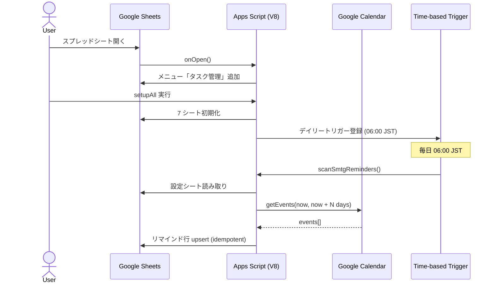

# task-board-sheets 仕様書

| 項目 | 値 |
|---|---|
| Author | yuuto22009911-hash |
| Client | 自社業務(個人利用 + 共有可能) |
| Status | **Approved** |
| Last Updated | 2026-04-30 |
| Estimate | 1人日 |

> 本書中の MUST / MUST NOT / SHOULD / SHOULD NOT / MAY は RFC 2119 に従って解釈する。

---

## 1. TL;DR

- **What**: Google スプレッドシート + Apps Script で動くタスク管理表。タスク / 会議日程 / リマインド / 企業 / 日報 / URL の 6 シートを 1 ファイルに集約。
- **Why**: スプレッドシート分散運用を 1 画面に統合し、SMTG 前日リマインドを自動化して抜け漏れを防ぐ。共有しやすさを最優先するため Web アプリではなく Sheets 上に実装する。
- **Success**: 1 ファイルで全業務情報を管理でき、SMTG 予定の前営業日に 100% 自動でリマインドが生成されること。Google Cloud Console の設定なしで動作すること。

## 2. Background

- 業務情報がスプレッドシート / メール / カレンダーに分散しており、横断検索ができない。
- SMTG 前日のリマインドメール作成が手作業で漏れが発生する。
- Web アプリ版 (`task-board`) は OAuth + Supabase の構築コストが個人利用には過剰だった。Google Cloud Console での OAuth クライアント作成も煩雑。
- スプレッドシートは標準で共有・権限管理が可能、Apps Script は Google アカウント内で完結し追加サービスが不要。

## 3. Goals / Non-Goals

### Goals

- [x] G1: 7 シート構成で全業務情報を 1 スプレッドシートに集約 (タスク / 会議日程 / リマインド / 企業 / 日報 / URL / 設定)
- [x] G2: Google Calendar の予定一覧をスプレッドシートに自動反映 (毎朝6時更新、過去日数〜先読み日数の範囲)
- [x] G3: Google Calendar の SMTG 予定を検出し、土日・日本祝日をスキップした前営業日にリマインドタスクを自動生成
- [x] G4: 全シートで新規追加・編集・削除が画面内で完結し、状況プルダウンで自動色分け、日付セルで日付ピッカーが開く
- [x] G5: Google Cloud Console の設定なしで動作 (Apps Script の OAuth スコープのみで完結)
- [x] G6: スプレッドシートを共有すれば共有相手も同じ機能を利用できる

### Non-Goals

- NG1: モバイルアプリ化 (Google Sheets 公式モバイルアプリで利用可能)
- NG2: メール本文の自動生成・送信 (リマインドタスクの作成までで止める)
- NG3: 複数ユーザー間でのタスク所有権分離 (スプレッドシート単位の共有のみ)
- NG4: Microsoft Outlook / iCloud Calendar との連携 (Google Calendar 専用)
- NG5: Web アプリ版 task-board との同期 (別プロダクト)

## 4. User Stories & Acceptance Criteria

### US-01: タスクを画面内で素早く追加・編集する

**As a** 業務担当者, **I want** タスクを行追加で次々入力できる, **so that** 思考の流れを止めずに記録できる.

**AC**:
- AC-01-1: **Given** タスク一覧シート表示中, **When** メニュー「タスク管理 → タスク追加」を実行, **Then** 行 2 (ヘッダー直下) に新規行が挿入され、タスク追加日に当日が、状況に「未着手」が自動入力され、企業名セル (B2) にフォーカスが移る。
- AC-01-2: **Given** タスク一覧シートの状況セル, **When** プルダウンから「未着手 / 進行中 / 依頼中 / 完了」のいずれかを選ぶ, **Then** それぞれ赤系 / 黄系 / グレー系 / 黄緑系の背景色とフォント色が即時反映される。
- AC-01-3: **Given** タスク一覧シートの期日セル, **When** ダブルクリック, **Then** Google Sheets の標準日付ピッカーが開き、日付を選択すると `yyyy/mm/dd` 書式で値が確定する。直接の文字入力は受け付けない (データ検証で拒否)。

### US-02: カレンダーの予定一覧を一目で確認する

**As a** 業務担当者, **I want** 設定した Google カレンダーの予定がスプレッドシート上に一覧で見える, **so that** カレンダーアプリを開かずとも今日以降の会議を確認できる.

**AC**:
- AC-02-1: **Given** 設定シートで指定したカレンダーに予定が複数ある, **When** メニュー「会議日程を今すぐ更新」を実行, **Then** 「会議日程」シートに開始日時/終了日時/タイトル/場所/説明/終日/カレンダー名/イベントID の8列で全予定が時系列(開始時刻昇順)で書き込まれる。
- AC-02-2: **Given** 同期実行, **When** 取得期間, **Then** (今日 - 過去日数) 〜 (今日 + 先読み日数) の範囲(設定シートで調整可、デフォルトは過去3日〜先14日)。
- AC-02-3: **Given** 同期実行, **When** 既存データが残っている, **Then** ヘッダー以外の全行をクリアしてから書き込む(スナップショット方式、UI操作で更新済の行は失われる)。
- AC-02-4: **Given** 終日予定, **When** 表示, **Then** 終日列に「○」が入り、開始/終了日時は時刻を含まない `yyyy/MM/dd (E)` 形式。
- AC-02-5: **Given** 開始日時が今日以降の行, **When** 表示, **Then** 薄い青背景 + 太字でハイライト(条件付き書式)。
- AC-02-6: 毎朝 6:00 JST に自動同期される(`installDailyTriggers_` が登録)。

### US-03: SMTG 前営業日に自動でリマインドが生成される

**As a** 業務担当者, **I want** カレンダー内の "SMTG" を含む予定の前営業日にリマインドが入る, **so that** 準備メール作成を忘れない.

**AC**:
- AC-03-1: **Given** 設定シートのカレンダーIDで指定したカレンダーに `[SMTG] A社 2026-05-12(火) 10:00` の予定がある, **When** 日次バッチ (6:00 JST) または手動で「SMTG リマインドを今すぐ作成」を実行, **Then** 期日 `2026-05-11(月)` のリマインド行がリマインドメールタスクシートに生成される。
- AC-03-2: **Given** SMTG が月曜日, **When** バッチ実行, **Then** 期日は前々金曜 (土日スキップ)。
- AC-03-3: **Given** SMTG 前日が日本の祝日, **When** バッチ実行, **Then** 期日はその直前の営業日 (祝日スキップ)。祝日判定には Google 公開カレンダー `ja.japanese#holiday@group.v.calendar.google.com` を参照する。
- AC-03-4: **Given** 同じ Google Calendar イベントに対して既存のリマインド行が存在する, **When** バッチ実行, **Then** 重複行は生成されない (idempotent)。
- AC-03-5: **Given** 設定シートの SMTG キーワードが `SMTG`, **When** 予定タイトルが `smtg定例` (小文字), **Then** 部分一致・大小無視でマッチして対象になる。

### US-04: 企業情報を一覧管理する

**AC**:
- AC-04-1: ユニット列は `SP / CM / AI / BO / 秘書 / HR / DW` のプルダウンで選択する。データ検証で他の値は受け付けない。
- AC-04-2: 議事録URL列に URL を入力すると、Google Sheets 標準の動作で別タブ遷移可能なリンクとして表示される。
- AC-04-3: アサイン日列はタスク一覧の期日と同じ日付ピッカーで入力する。

### US-05: 日報フォーマットをコピーして毎日蓄積する

**AC**:
- AC-05-1: メニュー「タスク管理 → 日報フォーマットを表示」を実行すると、設定シートで指定された日報テンプレートが当日日付で展開され、モーダルダイアログに表示される。
- AC-05-2: ダイアログ内の「クリップボードにコピーして閉じる」ボタンを押すと、テンプレート全文がクリップボードに保存され、ダイアログが閉じる。
- AC-05-3: 過去の日報は日報シートに行追加で蓄積され、日付列で降順ソート可能。

### US-06: URL 集を管理する

**AC**:
- AC-06-1: タイトル / URL / カテゴリ / メモの 4 列で CRUD できる。

### US-07: 自分の Google カレンダーを設定する

**AC**:
- AC-07-1: 設定シートの「カレンダーID」セル (B2) に `primary` または `xxx@group.calendar.google.com` 形式の ID を入力する。`primary` の場合はメインカレンダーが対象になる。
- AC-07-2: 初回 `setupAll` 実行時に Google が標準の OAuth 同意ダイアログを表示し、ユーザーがカレンダー読み取り権限を許可することで連携が完了する。Google Cloud Console での OAuth クライアント作成は不要。

### US-08: 改善アイデアを投稿する

**AC**:
- AC-08-1: メニュー「タスク管理 → 改善アイデアを送る」を実行するとカテゴリ選択 + 自由記述のダイアログが開く。
- AC-08-2: 送信した内容は非表示シート「改善アイデア」に投稿日時 / カテゴリ / 内容の 3 列で追記される。

### US-09: スプレッドシートを共有する

**AC**:
- AC-09-1: スプレッドシート右上の「共有」ボタンから個別招待またはリンク共有が可能。
- AC-09-2: 共有相手 (編集者権限) は同じメニュー「タスク管理」と Apps Script 機能を利用できる。

## 5. Functional Requirements (EARS)

- **FR-01**: The system SHALL initialize 8 sheets (タスク一覧 / 会議日程 / リマインドメールタスク / 企業リスト / 日報 / URL / 設定 / 改善アイデア) when `setupAll` is invoked.
- **FR-02**: The system SHALL register a custom menu titled "タスク管理" via `onOpen` trigger with 8 items: 初期セットアップ / タスク追加 / 会議日程を今すぐ更新 / SMTG リマインドを今すぐ作成 / 日報フォーマットを表示 / カレンダー設定を開く / 改善アイデアを送る / 使い方を表示.
- **FR-03**: When the user invokes "タスク追加", the system SHALL insert a new row at index 2 in タスク一覧, populate columns A and G with current date and "未着手" respectively, and move the active range to B2.
- **FR-04**: While the 状況 column holds value `未着手`, the system SHALL render the cell with red background (`#fde7e9`) and red text (`#d93025`) via conditional formatting. Equivalent rules apply for `進行中` (yellow), `依頼中` (gray), `完了` (green).
- **FR-05**: The system SHALL apply data validation `requireDate()` to the 期日 (タスク一覧 D列) and アサイン日 (企業リスト C列) columns, rejecting non-date input.
- **FR-06**: The system SHALL apply data validation `requireValueInList(...)` with `setAllowInvalid(false)` to: 優先度 (タスク一覧 E列), 状況 (タスク一覧 G列, リマインド D列), ユニット (企業リスト B列).
- **FR-07**: The system SHALL register two time-based triggers executing `syncCalendarEvents` and `scanSmtgReminders` every day at 06:00 in `Asia/Tokyo` timezone when `setupAll` is invoked.
- **FR-08**: When `scanSmtgReminders` runs, the system SHALL fetch events from the calendar specified by 設定シート B2 within the next N days where N is 設定シート B4 (default 14), filter events whose title contains 設定シート B3 keyword (default `SMTG`) case-insensitively, and create a row in リマインドメールタスク for each matched event.
- **FR-09**: When determining the due date, the system SHALL compute the previous business day by stepping back from the SMTG date, skipping Saturdays, Sundays, and Japan public holidays as listed in `ja.japanese#holiday@group.v.calendar.google.com`.
- **FR-10**: If a row in リマインドメールタスク already exists with the same Google Calendar event ID (column E), the system SHALL NOT create a duplicate row.
- **FR-11**: The system SHALL display a modal dialog containing the daily report template with `{DATE}` placeholder replaced by today's date when "日報フォーマットを表示" is invoked.
- **FR-12**: The system SHALL persist user-submitted improvement ideas to the 改善アイデア sheet with timestamp / category / content columns when "改善アイデアを送る" is submitted.
- **FR-13**: The system MUST NOT request OAuth scopes other than: `spreadsheets.currentonly`, `calendar.readonly`, `script.scriptapp`, `script.container.ui`.
- **FR-14**: If the calendar specified in 設定シート B2 cannot be resolved, the system SHALL show an alert with text instructing the user to check the calendar ID, without throwing an unhandled exception.
- **FR-15**: When `syncCalendarEvents` runs, the system SHALL fetch all events from the calendar specified by 設定シート B2 within the range (today - past_days) to (today + lookahead_days), clear existing rows in the 会議日程 sheet (preserving header), and write rows sorted by start time ascending.
- **FR-16**: While the 開始日時 column in 会議日程 contains a date string whose first 10 characters are `>=` today (in `YYYY/MM/DD` format), the system SHALL render the row with light-blue background (`#e8f0fe`) and bold text via conditional formatting.


## 6. Non-Functional Requirements

| カテゴリ | 要件 | 測定方法 |
|---|---|---|
| Performance | `addTaskRow` は呼び出しから 1 秒以内に完了 | Apps Script 実行ログ |
| Performance | `scanSmtgReminders` は 14 日先までのスキャンで 30 秒以内に完了 | Apps Script 実行ログ |
| Security | OAuth スコープは最小限 (FR-13) | `appsscript.json` レビュー |
| Security | スクリプトはユーザーの Google アカウント内でのみ実行され、外部サーバーへ送信しない | コードレビュー (`UrlFetchApp` 不使用) |
| Compatibility | Google Sheets が動作する全ブラウザ (Chrome / Safari / Edge / Firefox 最新2バージョン) | 実機確認 |
| Compatibility | Windows / macOS / iOS / Android で動作 (Sheets 公式アプリ含む) | 実機確認 |
| Cost | 月額 0 円 (Google Workspace 個人利用枠で完結) | 課金履歴 |
| Reliability | Apps Script デイリートリガーは Google の SLA に準拠 (公式実績 99% 以上) | Google Workspace ダッシュボード |
| Setup | 初期セットアップから初回タスク追加まで 5 分以内 | 動画計測 |

## 7. Design Outline

### 7.1 アーキテクチャ



### 7.2 技術スタック

| レイヤ | 採用 |
|---|---|
| UI | Google Sheets (Web / モバイル公式アプリ) |
| Logic | Google Apps Script V8 ランタイム |
| Storage | スプレッドシート自体 (各シートを表として利用) |
| Calendar | `CalendarApp` 組み込みサービス (OAuth スコープ `calendar.readonly`) |
| Holiday | Google 公開カレンダー `ja.japanese#holiday@group.v.calendar.google.com` |
| Trigger | `ScriptApp.newTrigger(...).timeBased()` |
| Auth | Google アカウント (OAuth は Apps Script が内部で処理) |
| Hosting | Google Drive |

### 7.3 主要データモデル

| シート | 列構成 | キー / 補足 |
|---|---|---|
| タスク一覧 | A: タスク追加日(date), B: 企業名, C: タスク内容, D: 期日(date), E: 優先度(enum), F: 詳細, G: 状況(enum) | 行追加は先頭 (insertRowBefore(2)) |
| リマインドメールタスク | A: 期日(text), B: SMTG開催日時(text), C: 対象予定タイトル, D: 状況(enum), E: カレンダーイベントID | E列がユニークキー (idempotency) |
| 企業リスト | A: 企業名, B: ユニット(enum), C: アサイン日(date), D: 支援期間, E: 議事録URL, F: 支援責任者, G: 支援担当者 | - |
| 日報 | A: 日付(date), B: 内容 | - |
| URL | A: タイトル, B: URL, C: カテゴリ, D: メモ | - |
| 設定 | A: 設定項目, B: 値, C: 説明 | A2:カレンダーID / A3:SMTGキーワード / A4:先読み日数 / A5:日報テンプレート |
| 改善アイデア (非表示) | A: 投稿日時, B: カテゴリ, C: 内容 | - |

### 7.4 enum 定義

- `優先度` = ['低', '中', '高']
- `状況 (タスク一覧)` = ['未着手', '進行中', '依頼中', '完了']
- `状況 (リマインド)` = ['未着手', '完了']
- `ユニット` = ['SP', 'CM', 'AI', 'BO', '秘書', 'HR', 'DW']

### 7.5 営業日計算アルゴリズム

```
function previousBusinessDay(d):
  result = d - 1日
  while result が 土曜 or 日曜 or 日本祝日:
    result = result - 1日
  return result

function isJapanHoliday(d):
  events = ja.japanese#holiday calendar 内の d の予定
  return events.length > 0
```

## 8. Risks / Open Questions

- [x] R1: Apps Script の実行時間制限 (6 分/呼び出し) → 14 日分 × 数件のスキャンであれば余裕。50 件超のSMTG予定は要分割。
- [x] R2: Google が祝日カレンダーの ID を変更する可能性 → 公開カレンダーの ID は安定運用されているが、変わった場合は `Code.gs` の定数を更新。
- [x] R3: ユーザーが意図せず `appsscript.json` のスコープを変更してしまう → README の編集前注意で対応。
- [ ] Q1: 企業名のオートコンプリート (タスク一覧から企業リストを参照) は将来追加するか? → Phase 2 候補。
- [ ] Q2: Slack 通知連携 → Phase 2 候補 (Webhook 設定のみで実現可能)。

## 9. Tasks (Implementation Status)

| Task | 紐付く要件 | 状態 |
|---|---|---|
| T-01: スプレッドシート 7 シート初期化 | FR-01, AC-01, AC-03, AC-05 | 完了 |
| T-02: メニュー登録 (onOpen) | FR-02 | 完了 |
| T-03: タスク追加機能 | FR-03, AC-01-1 | 完了 |
| T-04: 状況プルダウンと条件付き書式 | FR-04, AC-01-2 | 完了 |
| T-05: 日付ピッカー (データ検証) | FR-05, AC-01-3, AC-04-3 | 完了 |
| T-06: enum プルダウン (優先度・状況・ユニット) | FR-06, AC-04-1 | 完了 |
| T-07: デイリートリガー登録 | FR-07 | 完了 |
| T-08: SMTG リマインド スキャン | FR-08, AC-03-1, AC-03-5 | 完了 |
| T-09: 営業日計算 (土日 + 日本祝日) | FR-09, AC-03-2, AC-03-3 | 完了 |
| T-10: 重複防止 (idempotency) | FR-10, AC-03-4 | 完了 |
| T-11: 日報テンプレート ダイアログ | FR-11, AC-05-1, AC-05-2 | 完了 |
| T-12: 改善アイデア 投稿フォーム | FR-12, AC-08 | 完了 |
| T-13: 設定シート構築 | AC-07-1 | 完了 |
| T-14: HTML インストーラー (バッチ不要) | - | 完了 |
| T-15: GitHub Pages ホスト | - | 完了 |
| T-16: README + SETUP_GUIDE.md | - | 完了 |
| T-17: 会議日程シート + syncCalendarEvents | FR-01, FR-15, FR-16, AC-02 | 完了 |

## 10. Delivery

- **公開先**: GitHub `yuuto22009911-hash/task-board-sheets` (public)
- **インストーラー URL**: https://yuuto22009911-hash.github.io/task-board-sheets/
- **Apps Script ソース**: `apps-script/Code.gs`
- **使用承認**: 個人利用 + 任意の共有先での利用を許可。改変自由。
